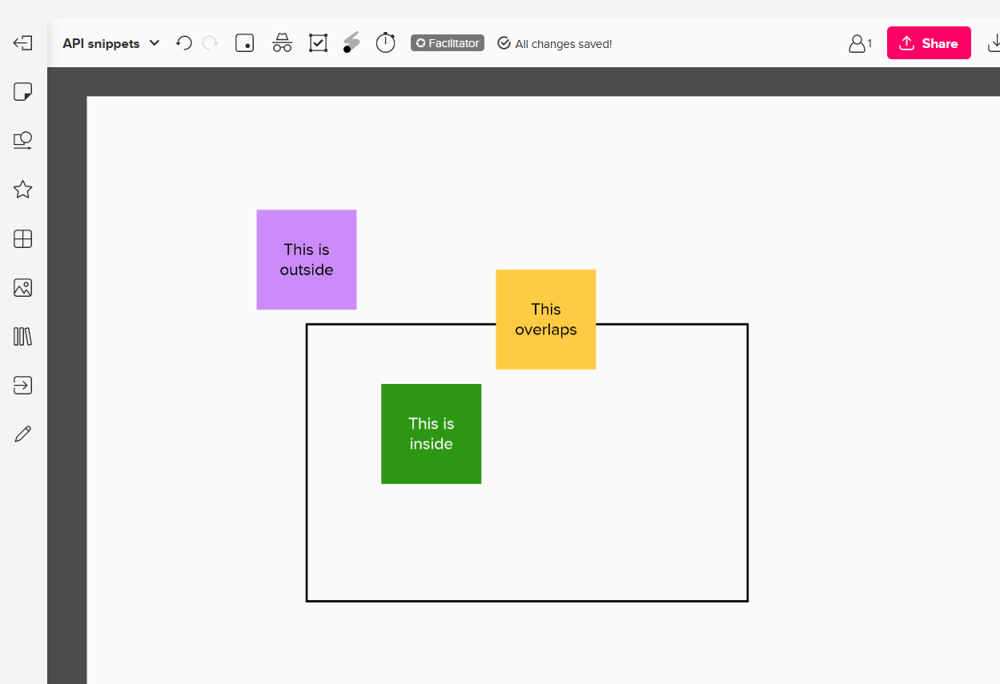
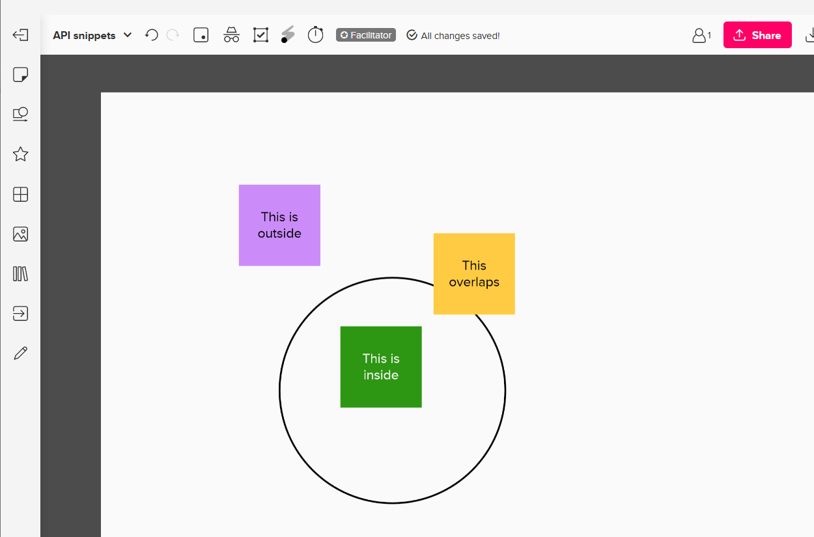
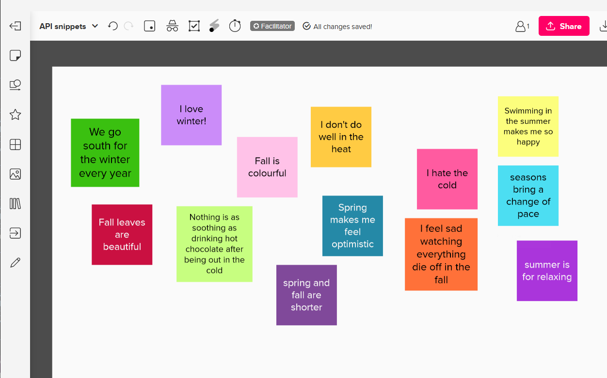
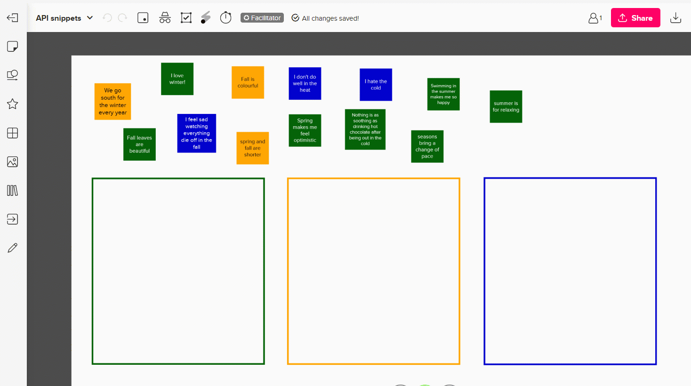
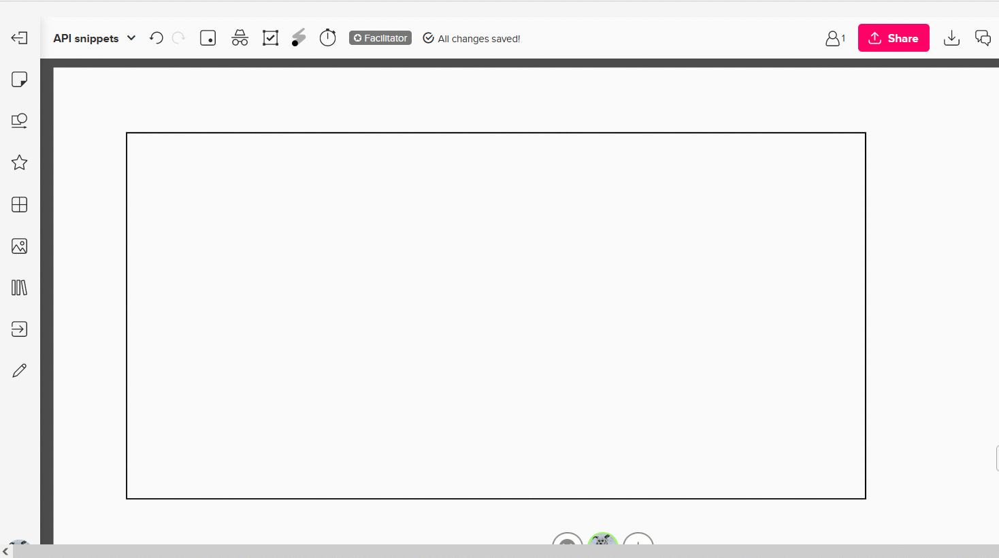
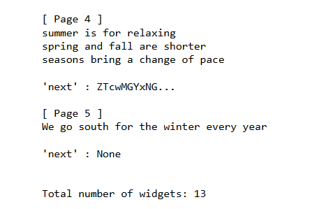
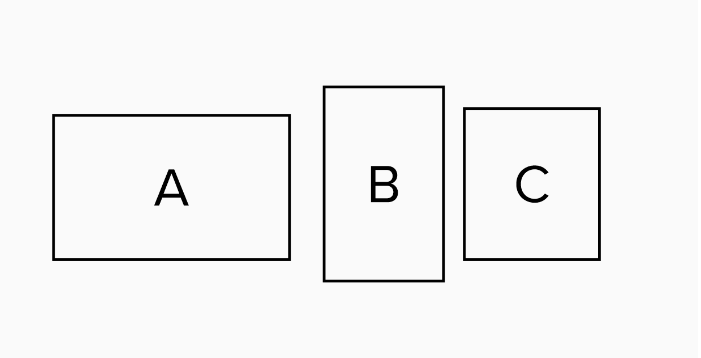
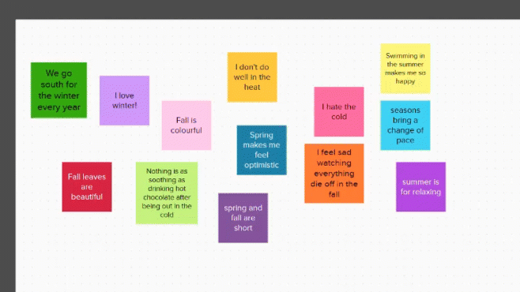
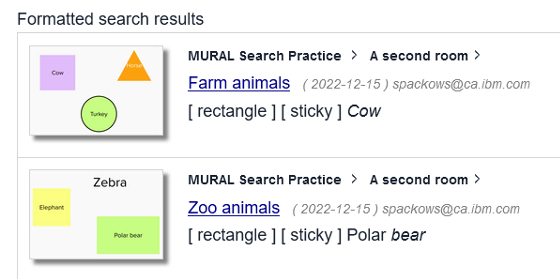

# MURAL API Samples

Sample code snippets demonstrating using the MURAL API

&nbsp;

<table>
<tr><th>Sample</th><th>Demonstrates how to ...</th></tr>
<!-- sample 01 -->
<tr>
<td valign="top">

<b>sample-01_create-a-mural</b>

</td>
<td valign="top">

Create a new mural from mural widgets saved in .json format

<ul>
<li><a href="murals/sample-02_overlap-inside-rectangle.json">Sample mural .json</a></li>
<li><a href="notebooks/sample-01_create-a-mural.ipynb">Sample Python notebook</a></li>
</ul>
</td>
</tr>
<!-- sample 02 -->
<tr>
<td valign="top">

<b>sample-02_overlap-inside-rectangle</b>

</td>
<td valign="top">

Tell if a sticky note is overlapping or inside of a rectangle shape

<ul>
<li><a href="murals/sample-02_overlap-inside-rectangle.json">Sample mural .json</a></li>
<li><a href="notebooks/sample-02_overlap-inside-rectangle.ipynb">Sample Python notebook</a></li>
</ul>
</td>
</tr>
<!-- sample 03 -->
<tr>
<td valign="top">

<b>sample-03_overlap-inside-circle</b>

</td>
<td valign="top">

Tell if a sticky note is overlapping or inside of a circle shape

<ul>
<li><a href="murals/sample-03_overlap-inside-circle.json">Sample mural .json</a></li>
<li><a href="notebooks/sample-03_overlap-inside-circle.ipynb">Sample Python notebook</a></li>
</ul>
</td>
</tr>
<!-- sample 04 -->
<tr>
<td valign="top">

<b>sample-04_sentiment</b>

</td>
<td valign="top">

Analyze the sentiment of sticky notes in a mural

Uses the <a href="https://dataplatform.cloud.ibm.com/docs/content/wsj/analyze-data/watson-nlp.html">IBM Watson NLP Python library</a>

<ul>
<li><a href="murals/sample-04_sentiment.json">Sample mural .json</a></li>
<li><a href="notebooks/sample-04_sentiment.ipynb">Sample Python notebook</a></li>
</ul>
</td>
</tr>
<!-- sample 05 -->
<tr>
<td valign="top">

<b>sample-05_color-code-by-sentiment</b>

</td>
<td valign="top">

Change the color of sticky notes in a mural

Uses the <a href="https://dataplatform.cloud.ibm.com/docs/content/wsj/analyze-data/watson-nlp.html">IBM Watson NLP Python library</a>

<ul>
<li><a href="murals/sample-05_color-code-by-sentiment.json">Sample mural .json</a></li>
<li><a href="notebooks/sample-05_color-code-by-sentiment.ipynb">Sample Python notebook</a></li>
</ul>
</td>
</tr>
<!-- sample 06 -->
<tr>
<td valign="top">

<b>sample-06_group</b>

</td>
<td valign="top">

Move sticky notes into organized groupings inside shapes

<ul>
<li><a href="murals/sample-06_group.json">Sample mural .json</a></li>
<li><a href="notebooks/sample-06_group.ipynb">Sample Python notebook</a></li>
</ul>
</td>
</tr>
<!-- sample 07 -->
<tr>
<td valign="top">

<b>sample-07_add-sticky-notes</b>

</td>
<td valign="top">

Add sticky notes into a rectangle in organic-seeming, random positions

<ul>
<li><a href="notebooks/sample-07_add-sticky-notes.ipynb">Sample Python notebook</a></li>
</ul>
</td>
</tr>
<!-- sample 08 -->
<tr>
<td valign="top">

<b>sample-08_paginate-through-widgets</b>

</td>
<td valign="top">

Paginate through <tt>getwidgets</tt> results

<ul>
<li><a href="murals/sample-04_sentiment.json">Sample mural .json</a></li>
<li><a href="notebooks/sample-08_paginate-through-widgets.ipynb">Sample Python notebook</a></li>
</ul>
</td>
</tr>
<!-- sample 09 -->
<tr>
<td valign="top">

<b>sample-09_absolute-position</b>

</td>
<td valign="top">

Get the absolute <tt>[ x, y ]</tt> position of grouped widgets

<ul>
<li><a href="murals/sample-09_absolute-position.json">Sample mural .json</a></li>
<li><a href="notebooks/sample-09_absolute-position.ipynb">Sample Python notebook</a></li>
</ul>
</td>
</tr>
<!-- sample 10 -->
<tr>
<td valign="top">

<b>sample-10_translate</b>

</td>
<td valign="top">

Post a copy of each English sticky note translated into French

Uses <a href="https://cloud.ibm.com/catalog/services/language-translator">IBM Watson Language Translator</a>

<ul>
<li><a href="https://medium.com/@sarah-packowski/multilingual-mural-b14d8f78ec66">Blog post</a></li>
<li><a href="murals/sample-04_sentiment.json">Sample mural .json</a></li>
<li><a href="notebooks/sample-10_translate.ipynb">Sample Python notebook</a></li>
</ul>
</td>
</tr>
<!-- sample 11 -->
<tr>
<td valign="top">

<b>sample-11_search</b>

</td>
<td valign="top">

Search murals using <a href="https://cloud.ibm.com/catalog/services/watson-discovery">IBM Watson Discovery</a>

<ul>
<li><a href="https://medium.com/@sarah-packowski/searching-in-mural-8aad3c224e6c">Blog post</a></li>
<li><a href="murals/Discovery_sample-murals.json">Sample murals (.json)</a></li>
<li>Sample Python notebooks:
<ul>
<li><a href="notebooks/Discovery_00-Create-sample-murals-to-search.ipynb">Create sample murals</a></li>
<li><a href="notebooks/Discovery_01-Read-data-from-MURAL.ipynb">Read live data from murals</a></li>
<li><a href="notebooks/Discovery_02-Upload-documents-to-Discovery.ipynb">Index data in Discovery</a></li>
<li><a href="notebooks/Discovery_03-Search-murals-in-Discovery.ipynb">Search murals</a></li>
</ul>
<li><a href="https://github.com/spackows/MURAL-search">Sample Flask app</a></li>
</li>
</ul>
</td>
</tr>
<!-- sample 12 -->
<tr>
<td valign="top">

<b>sample-12_GPT-3</b>

</td>
<td valign="top">

Seed a mural with content generated by a GPT model using the OpenAI API

<ul>
<li><a href="https://sarah-packowski.medium.com/use-gpt-3-to-seed-mural-856ed6b22ed9">Blog post</a></li>
<li><a href="https://github.com/spackows/MURAL-GPT-3-Prospective-Hindsight">Sample Python code</a></li>
<li><a href="https://youtu.be/TAA_1OULRJ8">Demo video</a></li>
</ul>
</td>
</tr>
<!-- sample 13 -->
<tr>
<td valign="top">

<b>sample-13_devils-advocate</b>

</td>
<td valign="top">

Seed a mural with arguments against proposed plans using a foundation model in <a href="https://www.ibm.com/products/watsonx-ai">IBM watsonx.ai</a>

<ul>
<li><a href="https://sarah-packowski.medium.com/have-an-llm-play-devils-advocate-to-improve-your-chance-of-success-31bf3a39e930">Blog post</a></li>
<li><a href="notebooks/sample-13_devils-advocate.ipynb">Sample Python notebook</a></li>
</ul>
</td>
</tr>
<!-- sample 14 -->
<tr>
<td valign="top">

<b>sample-14_classify-by-class-name</b>

</td>
<td valign="top">

Classify sticky notes by class name only, using a foundation model in <a href="https://www.ibm.com/products/watsonx-ai">IBM watsonx.ai</a>

<ul>
<li><a href="notebooks/sample-14_classify-by-class-name.ipynb">Sample Python notebook</a></li>
</ul>
</td>
</tr>
<!-- sample 15 -->
<tr>
<td valign="top">

<b>sample-15_classify-by-description</b>

</td>
<td valign="top">

Classify sticky notes by class description, using a foundation model in <a href="https://www.ibm.com/products/watsonx-ai">IBM watsonx.ai</a>

<ul>
<li><a href="notebooks/sample-15_classify-by-description.ipynb">Sample Python notebook</a></li>
</ul>
</td>
</tr>
</table>

&nbsp;

